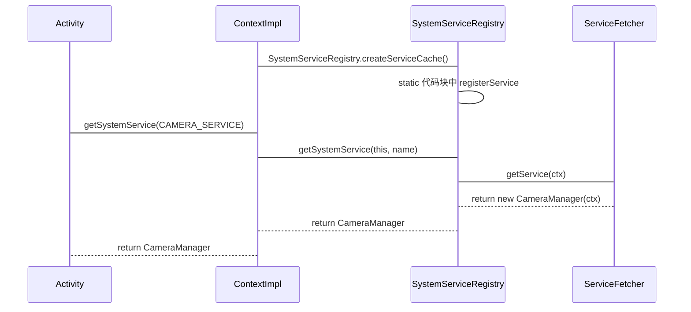
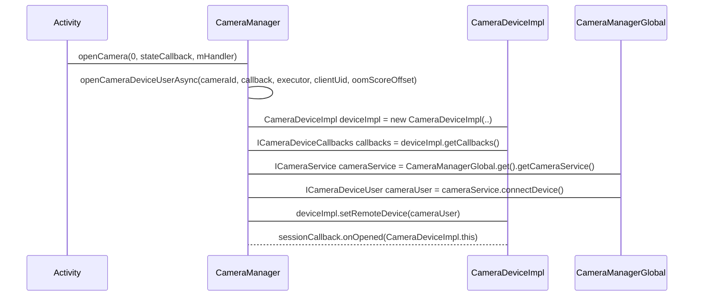

## Camera2 预览

Camera2的预览实现大致分四步：
1、获取 CameraManager
2、通过 CameraManager 获取 CameraDevice 
3、通过 CameraDevice 获取 CameraCaptureSession
4、通过 CameraCaptureSession 发送预览请求

CameraManager 是服务管理类，内部持有一个CameraService服务：CameraManagerGlobal（这是一个内部类）
CameraDevice 可以理解为Camera设备映射，内部持有了 CameraManagerGlobal.connect 后的 ICameraDeviceUser 实例


#### 获取 CameraManager
CameraManager 是通过调用 getSystemService(CAMERA_SERVICE) 获取的
1、getSystemService 最终调用的是 ContextImpl 的方法
2、ContextImpl 调用 SystemServiceRegistry 的静态方法 getSystemService 获取
3、SystemServiceRegistry 内部会缓存一个 CameraManager 对象



```java
class ActivityThread {
  private Activity performLaunchActivity(ActivityClientRecord r, Intent customIntent) {

    // 构建 ContextImpl
    ContextImpl appContext = createBaseContextForActivity(r);

    // 通过反射构建 Activity
    Activity activity = null;
    java.lang.ClassLoader cl = appContext.getClassLoader();
    activity = mInstrumentation.newActivity(cl, component.getClassName(), r.intent);

    // attach  ContextImpl 到 Activity
    activity.attach(appContext, this, getInstrumentation(), r.token,
            r.ident, app, r.intent, r.activityInfo, title, r.parent,
            r.embeddedID, r.lastNonConfigurationInstances, config,
            r.referrer, r.voiceInteractor, window, r.configCallback,
            r.assistToken, r.shareableActivityToken);

    return activity;
  }
}

class SystemServiceRegistry {
  static {
    registerService(Context.CAMERA_SERVICE, CameraManager.class,
            // CachedServiceFetcher 有缓存处理逻辑
            new CachedServiceFetcher<CameraManager>() {
              @Override
              public CameraManager createService(ContextImpl ctx) {
                return new CameraManager(ctx);
              }
            });
  }
  public static Object getSystemService(ContextImpl ctx, String name) {
    final ServiceFetcher<?> fetcher = SYSTEM_SERVICE_FETCHERS.get(name);
    final Object ret = fetcher.getService(ctx);
    return ret;
  }
}
```

#### 获取 CameraDevice
1、new 一个 CameraDevice 的回调 StateCallback
2、在调用 `CameraManager#openCamera(String cameraId, StateCallback callback, Handler handler)` 时， 将 StateCallback 传进去
3、在 openCamera 内部会回调 StateCallback 的 onOpened() 方法，将 CameraDeviceImpl 返回给调用者。具体如下：
- 会构建一个 CameraDeviceImpl 实例，并将 StateCallback 通过构造方法传进去。CameraDeviceImpl 继承了 CameraDevice（CameraDevice是一个抽象类）
- 获取 CameraDeviceImpl 的 CameraDeviceCallbacks（CameraDeviceCallbacks 是一个客户的 Binder 实例，会与服务端交互）
- 调用 CameraManagerGlobal 的 getCameraService() 方法获取 Camera 服务 ICameraService
  - getCameraService() 内部会将获取服务端实例，并将 CameraManagerGlobal 添加到服务端的状态回调列表中
  - 之后将 ICameraService 逐层返回给 CameraDeviceImpl
- 调用 ICameraService 的 connectDevice() 方法连接服务端，将CameraDeviceCallbacks传给服务端，该方法会返回一个 ICameraDeviceUser 对象
- 调用 CameraDeviceImpl 的 setRemoteDevice(cameraUser) 方法，将 ICameraDeviceUser 传递进去
- 在 setRemoteDevice 内部会执行一个 Runnable，Runnable内部会回调 StateCallback 的 onOpened() 方法，将 CameraDeviceImpl 返回给调用者




### 通过 CameraDevice 获取 CameraCaptureSession
1、new 一个 CameraCaptureSession 的回调 StateCallback
2、在调用 `CameraDeviceImpl#createCaptureSession(Collections.singletonList(holder.getSurface()), stateCallback, mHandler)` 时， 将 StateCallback 传进去
3、createCaptureSession 方法中最终会构建对象 CameraCaptureSessionImpl，在构造方法中回调 onConfigured，并把当前对象传递过去

### 通过 CameraCaptureSession 发送预览请求
session.setRepeatingRequest(captureRequest.build(), null, mHandler) 发送预览请求
setRepeatingRequest 内部会通过 CameraDeviceImpl 最终调用 ICameraDeviceUser 的 submitRequestList 方法，将 CaptureRequest 提交给服务端