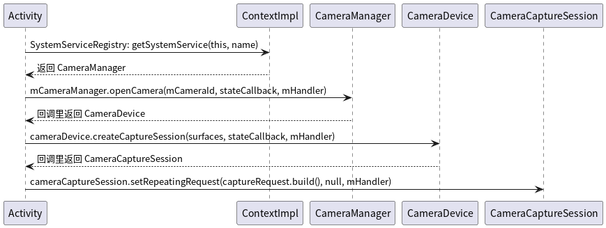

# Camera2 预览

## Camera2的预览实现大致分四步：

- 通过 ContextImpl 获取 CameraManager
- 通过 CameraManager 获取 CameraDevice
- 通过 CameraDevice 获取 CameraCaptureSession
- 通过 CameraCaptureSession 发送预览请求

### 类功能的说明、时序图、关键代码

**CameraManager**
CameraManager 是服务管理类，内部持有一个CameraService服务：CameraManagerGlobal（这是一个内部类）
**CameraDevice**
CameraDevice 可以理解为Camera设备映射，内部持有ICameraDeviceUser。ICameraDeviceUser是 CameraManagerGlobal.connect
后的返回的实例
**CameraCaptureSession**
CameraCaptureSession 是一个会话连接

**时序图**


**关键代码**

```java
public class SurfaceViewActivity extends AppCompatActivity {

    private CameraManager mCameraManager;

    @Override
    protected void onCreate(@Nullable Bundle savedInstanceState) {
        super.onCreate(savedInstanceState);
        // step1
        mCameraManager = (CameraManager) getSystemService(CAMERA_SERVICE);

        SurfaceHolder.Callback callback = new SurfaceHolder.Callback() {
            @Override
            public void surfaceCreated(@NonNull SurfaceHolder holder) {
                // step2
                openCamera(holder);
            }
            // ...
        };
        mSvPreview.getHolder().addCallback(callback);
    }

    private void openCamera(SurfaceHolder holder) throws CameraAccessException {
        CameraDevice.StateCallback stateCallback = new CameraDevice.StateCallback() {
            @Override
            public void onOpened(@NonNull CameraDevice camera) {
                Log.i(TAG, "onOpened: ");
                try {
                    // step3
                    initPreviewRequest(mCameraDevice, holder);
                } catch (CameraAccessException e) {
                    toast("init preview failed");
                    e.printStackTrace();
                }
            }
            // ...
        };
        // perform step2
        mCameraManager.openCamera(mCameraId, stateCallback, mHandler);
    }

    private void initPreviewRequest(CameraDevice cameraDevice, SurfaceHolder holder) throws CameraAccessException {
        CaptureRequest.Builder captureRequest = cameraDevice.createCaptureRequest(CameraDevice.TEMPLATE_PREVIEW);
        captureRequest.addTarget(holder.getSurface());
        CameraCaptureSession.StateCallback stateCallback = new CameraCaptureSession.StateCallback() {
            @Override
            public void onConfigured(@NonNull CameraCaptureSession cameraCaptureSession) {
                try {
                    // step4 开始预览，即一直发送预览的请求
                    cameraCaptureSession.setRepeatingRequest(captureRequest.build(), null, mHandler);
                } catch (CameraAccessException e) {
                    toast("request failed");
                    e.printStackTrace();
                }
            }
            // ...
        };

        // perform step3
        // handle 传入 null 表示使用当前线程的 Looper
        cameraDevice.createCaptureSession(Arrays.asList(holder.getSurface(), mImageReader.getSurface()), stateCallback, mHandler);
    }
}
```

## 具体每一步的细节

### 获取 CameraManager 的流程

CameraManager 是通过调用 getSystemService(CAMERA_SERVICE) 获取的

- 在 Activity 中调用 getSystemService(CAMERA_SERVICE) 最终调用的是 ContextImpl 的方法
- ContextImpl 调用 SystemServiceRegistry 的静态方法 getSystemService 获取
- SystemServiceRegistry 内部会缓存一个 CameraManager 对象

**ContextImpl 类图**


**时序图**


**关键代码**

```java
// ContextWrapper 中的 mBase 在 performLaunchActivity 中调用了 attach 赋值的
class ActivityThread {
    private Activity performLaunchActivity(ActivityClientRecord r, Intent customIntent) {

        // 构建 ContextImpl
        ContextImpl appContext = createBaseContextForActivity(r);

        // 通过反射构建 Activity
        Activity activity = null;
        java.lang.ClassLoader cl = appContext.getClassLoader();
        activity = mInstrumentation.newActivity(cl, component.getClassName(), r.intent);

        // attach  ContextImpl 到 Activity
        activity.attach(appContext, this, getInstrumentation(), r.token,
                r.ident, app, r.intent, r.activityInfo, title, r.parent,
                r.embeddedID, r.lastNonConfigurationInstances, config,
                r.referrer, r.voiceInteractor, window, r.configCallback,
                r.assistToken, r.shareableActivityToken);

        return activity;
    }
}

class SystemServiceRegistry {
    static {
        registerService(Context.CAMERA_SERVICE, CameraManager.class,
                // CachedServiceFetcher 有缓存处理逻辑
                new CachedServiceFetcher<CameraManager>() {
                    @Override
                    public CameraManager createService(ContextImpl ctx) {
                        return new CameraManager(ctx);
                    }
                });
    }

    public static Object getSystemService(ContextImpl ctx, String name) {
        final ServiceFetcher<?> fetcher = SYSTEM_SERVICE_FETCHERS.get(name);
        final Object ret = fetcher.getService(ctx);
        return ret;
    }
}
```

### 获取 CameraDevice 的流程

- new 一个 CameraDevice 的回调 StateCallback
- 在调用 `CameraManager#openCamera(String cameraId, StateCallback callback, Handler handler)` 时，
  将StateCallback 传进去
- 在 openCamera 内部会回调 StateCallback 的 onOpened() 方法，将 CameraDeviceImpl 返回给调用者。具体如下：
    - 构建一个 CameraDeviceImpl 实例，并将 StateCallback 通过构造方法传进去
        - CameraDeviceImpl 继承了 CameraDevice
        - CameraDevice是一个抽象类
    - 获取 CameraDeviceImpl 的 CameraDeviceCallbacks
        - CameraDeviceCallbacks 是一个客户的 Binder 实例，与服务端交互
    - 调用 CameraManagerGlobal 的 getCameraService() 方法获取 Camera 服务 ICameraService
        - getCameraService() 内部会将获取服务端实例，并将 CameraManagerGlobal 添加到服务端的状态回调列表中
        - 之后将 ICameraService 逐层返回给 CameraDeviceImpl
    - 调用 ICameraService 的 connectDevice()
      方法连接服务端，将CameraDeviceCallbacks传给服务端，该方法会返回一个ICameraDeviceUser 对象
    - 调用 CameraDeviceImpl 的 setRemoteDevice(cameraUser) 方法，将 ICameraDeviceUser 传递进去
    - 在 setRemoteDevice 内部会执行一个 Runnable，Runnable内部会回调 StateCallback 的 onOpened()
      方法，将CameraDeviceImpl 返回给调用者

**时序图**


### 获取 CameraCaptureSession 的流程

- new 一个 CameraCaptureSession 的回调 StateCallback
-

在调用 `CameraDeviceImpl#createCaptureSession(Collections.singletonList(holder.getSurface()), stateCallback, mHandler)`
时， 将 StateCallback 传进去

- createCaptureSession 方法中最终会构建对象 CameraCaptureSessionImpl，在构造方法中回调 onConfigured，并把当前对象传递过去

### 通过 CameraCaptureSession 发送预览请求

session.setRepeatingRequest(captureRequest.build(), null, mHandler) 发送预览请求 setRepeatingRequest 内部会通过
CameraDeviceImpl 最终调用 ICameraDeviceUser 的 submitRequestList 方法，将 CaptureRequest 提交给服务端