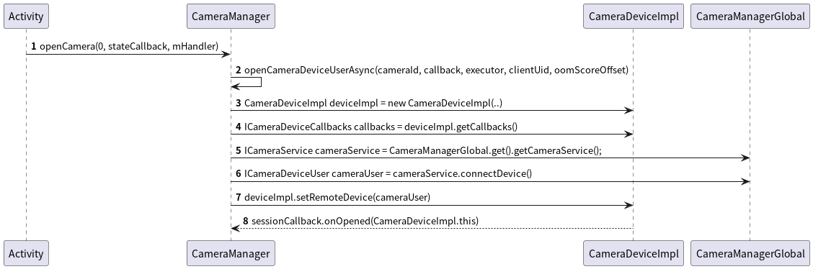

# Camera2 预览

## Camera2的预览实现大致分四步：

- 通过 ContextImpl 获取 CameraManager
- 通过 CameraManager 获取 CameraDevice
- 通过 CameraDevice 获取 CameraCaptureSession
- 通过 CameraCaptureSession 发送预览请求

### 类功能的说明、时序图、关键代码

**CameraManager**

CameraManager 是服务管理类，内部持有一个CameraService服务：CameraManagerGlobal（这是一个内部类）

**CameraDevice**

CameraDevice 可以理解为Camera设备映射，内部持有ICameraDeviceUser。ICameraDeviceUser是 CameraManagerGlobal.connect
后的返回的实例

**CameraCaptureSession**

CameraCaptureSession 是一个会话连接

**时序图**


**关键代码**

```java
public class SurfaceViewActivity extends AppCompatActivity {

    private CameraManager mCameraManager;

    @Override
    protected void onCreate(@Nullable Bundle savedInstanceState) {
        super.onCreate(savedInstanceState);
        // step1
        mCameraManager = (CameraManager) getSystemService(CAMERA_SERVICE);

        SurfaceHolder.Callback callback = new SurfaceHolder.Callback() {
            @Override
            public void surfaceCreated(@NonNull SurfaceHolder holder) {
                // step2
                openCamera(holder);
            }
            // ...
        };
        mSvPreview.getHolder().addCallback(callback);
    }

    private void openCamera(SurfaceHolder holder) throws CameraAccessException {
        CameraDevice.StateCallback stateCallback = new CameraDevice.StateCallback() {
            @Override
            public void onOpened(@NonNull CameraDevice camera) {
                Log.i(TAG, "onOpened: ");
                try {
                    // step3
                    initPreviewRequest(mCameraDevice, holder);
                } catch (CameraAccessException e) {
                    toast("init preview failed");
                    e.printStackTrace();
                }
            }
            // ...
        };
        // perform step2
        mCameraManager.openCamera(mCameraId, stateCallback, mHandler);
    }

    private void initPreviewRequest(CameraDevice cameraDevice, SurfaceHolder holder) throws CameraAccessException {
        CaptureRequest.Builder captureRequest = cameraDevice.createCaptureRequest(CameraDevice.TEMPLATE_PREVIEW);
        captureRequest.addTarget(holder.getSurface());
        CameraCaptureSession.StateCallback stateCallback = new CameraCaptureSession.StateCallback() {
            @Override
            public void onConfigured(@NonNull CameraCaptureSession cameraCaptureSession) {
                try {
                    // step4 开始预览，即一直发送预览的请求
                    cameraCaptureSession.setRepeatingRequest(captureRequest.build(), null, mHandler);
                } catch (CameraAccessException e) {
                    toast("request failed");
                    e.printStackTrace();
                }
            }
            // ...
        };

        // perform step3
        // handle 传入 null 表示使用当前线程的 Looper
        cameraDevice.createCaptureSession(Arrays.asList(holder.getSurface(), mImageReader.getSurface()), stateCallback, mHandler);
    }
}
```

## 具体每一步的细节

### 获取 CameraManager

CameraManager 是通过调用 getSystemService(CAMERA_SERVICE) 获取的

- 在 Activity 中调用 getSystemService(CAMERA_SERVICE) 最终调用的是 ContextImpl 的方法
- ContextImpl 调用 SystemServiceRegistry 的静态方法 getSystemService 获取
- SystemServiceRegistry 内部会缓存一个 CameraManager 对象

**ContextImpl 类图**


**时序图**


**关键代码**

```java
// ContextWrapper 中的 mBase 在 performLaunchActivity 中调用了 attach 赋值的
class ActivityThread {
    private Activity performLaunchActivity(ActivityClientRecord r, Intent customIntent) {

        // 构建 ContextImpl
        ContextImpl appContext = createBaseContextForActivity(r);

        // 通过反射构建 Activity
        Activity activity = null;
        java.lang.ClassLoader cl = appContext.getClassLoader();
        activity = mInstrumentation.newActivity(cl, component.getClassName(), r.intent);

        // attach  ContextImpl 到 Activity
        activity.attach(appContext, this, getInstrumentation(), r.token,
                r.ident, app, r.intent, r.activityInfo, title, r.parent,
                r.embeddedID, r.lastNonConfigurationInstances, config,
                r.referrer, r.voiceInteractor, window, r.configCallback,
                r.assistToken, r.shareableActivityToken);

        return activity;
    }
}

class SystemServiceRegistry {
    static {
        registerService(Context.CAMERA_SERVICE, CameraManager.class,
                // CachedServiceFetcher 有缓存处理逻辑
                new CachedServiceFetcher<CameraManager>() {
                    @Override
                    public CameraManager createService(ContextImpl ctx) {
                        return new CameraManager(ctx);
                    }
                });
    }

    public static Object getSystemService(ContextImpl ctx, String name) {
        final ServiceFetcher<?> fetcher = SYSTEM_SERVICE_FETCHERS.get(name);
        final Object ret = fetcher.getService(ctx);
        return ret;
    }
}
```

### 获取 CameraDevice 的流程

- new 一个 CameraDevice 的回调 StateCallback
- 在调用 `CameraManager#openCamera(String cameraId, StateCallback callback, Handler handler)` 时， 将
  StateCallback 传进去
- 在 openCamera 内部会回调 StateCallback 的 `onOpened()` 方法，将 CameraDeviceImpl 返回给调用者。具体如下：
    - 构建一个 CameraDeviceImpl 实例，并将 StateCallback 通过构造方法传进去
        - CameraDeviceImpl 继承了 CameraDevice
        - CameraDevice 是一个抽象类
    - 获取 CameraDeviceImpl 的 CameraDeviceCallbacks
        - CameraDeviceCallbacks 是一个客户的 Binder 实例，与服务端交互
    - 调用 CameraManagerGlobal 的 `getCameraService()` 方法获取 Camera 服务 ICameraService
        - `getCameraService()` 内部会将获取服务端实例，并将 CameraManagerGlobal 添加到服务端的状态回调列表中
        - 之后将 ICameraService 逐层返回给 CameraDeviceImpl
    - 调用 ICameraService 的 `connectDevice()`
      方法连接服务端，将CameraDeviceCallbacks传给服务端，该方法会返回一个ICameraDeviceUser 对象
    - 调用 CameraDeviceImpl 的 `setRemoteDevice(cameraUser)` 方法，将 ICameraDeviceUser 传递进去
    - 在 setRemoteDevice 内部会执行一个 Runnable，Runnable内部会回调 StateCallback 的 `onOpened()`
      方法，将CameraDeviceImpl 返回给调用者

**时序图**



**关键代码**

```java
class CameraManager {
    private CameraDevice openCameraDeviceUserAsync(String cameraId,
                                                   CameraDevice.StateCallback callback, Executor executor, final int uid,
                                                   final int oomScoreOffset) throws CameraAccessException {
        CameraDevice device = null;
        ICameraDeviceUser cameraUser = null;

        // 构建一个 CameraDeviceImpl 实例，并将 StateCallback 通过构造方法传进去
        android.hardware.camera2.impl.CameraDeviceImpl deviceImpl =
                new android.hardware.camera2.impl.CameraDeviceImpl(
                        cameraId,
                        callback,
                        executor,
                        characteristics,
                        physicalIdsToChars,
                        mContext.getApplicationInfo().targetSdkVersion,
                        mContext);

        // 获取 CameraDeviceImpl 的 CameraDeviceCallbacks, CameraDeviceCallbacks 是一个客户的 Binder 实例，与服务端交互
        ICameraDeviceCallbacks callbacks = deviceImpl.getCallbacks();

        // 调用 CameraManagerGlobal 的 `getCameraService()` 方法获取 Camera 服务 ICameraService
        ICameraService cameraService = CameraManagerGlobal.get().getCameraService();

        // 调用 ICameraService 的 `connectDevice()`
        cameraUser = cameraService.connectDevice(callbacks, cameraId,
                mContext.getOpPackageName(), mContext.getAttributionTag(), uid,
                oomScoreOffset, mContext.getApplicationInfo().targetSdkVersion);

        // 调用 CameraDeviceImpl 的 `setRemoteDevice(cameraUser)` 方法，将 ICameraDeviceUser 传递进去
        deviceImpl.setRemoteDevice(cameraUser);
        device = deviceImpl;
        return device;
    }

    // binder client
    private static final class CameraManagerGlobal extends ICameraServiceListener.Stub {
        public ICameraService getCameraService() {
            synchronized (mLock) {
                connectCameraServiceLocked();
                return mCameraService;
            }
        }

        private void connectCameraServiceLocked() {
            // 获取 binder 服务端
            IBinder cameraServiceBinder = ServiceManager.getService(CAMERA_SERVICE_BINDER_NAME);
            cameraServiceBinder.linkToDeath(this, /*flags*/ 0);
            ICameraService cameraService = ICameraService.Stub.asInterface(cameraServiceBinder);

            // ？
            CameraMetadataNative.setupGlobalVendorTagDescriptor();

            // 将 CameraManagerGlobal 添加到服务端的状态回调列表中
            CameraStatus[] cameraStatuses = cameraService.addListener(this);

            // 赋值
            mCameraService = cameraService;
        }
    }
}

public class CameraDeviceImpl extends CameraDevice implements IBinder.DeathRecipient {

    public CameraDeviceImpl(String cameraId, StateCallback callback, Executor executor,
                            CameraCharacteristics characteristics,
                            Map<String, CameraCharacteristics> physicalIdsToChars,
                            int appTargetSdkVersion,
                            Context ctx) {
        // 赋值callback
        mDeviceCallback = callback;
    }

    public void setRemoteDevice(ICameraDeviceUser remoteDevice) throws CameraAccessException {
        synchronized (mInterfaceLock) {
            mRemoteDevice = new ICameraDeviceUserWrapper(remoteDevice);
            IBinder remoteDeviceBinder = remoteDevice.asBinder();
            if (remoteDeviceBinder != null) {
                remoteDeviceBinder.linkToDeath(this, /*flag*/ 0);
            }

            mDeviceExecutor.execute(mCallOnOpened);
            mDeviceExecutor.execute(mCallOnUnconfigured);
        }
    }

    private final Runnable mCallOnOpened = new Runnable() {
        @Override
        public void run() {
            StateCallbackKK sessionCallback = null;
            synchronized (mInterfaceLock) {
                sessionCallback = mSessionStateCallback;
            }
            if (sessionCallback != null) {
                sessionCallback.onOpened(CameraDeviceImpl.this);
            }

            // 回调 onOpened
            mDeviceCallback.onOpened(CameraDeviceImpl.this);
        }
    };
}
```

### 获取 CameraCaptureSession 的流程

- new 一个 CameraCaptureSession 的回调 `CameraCaptureSession.StateCallback`
- 在调用 `CameraDeviceImpl#createCaptureSession(Collections.singletonList(holder.getSurface()), stateCallback, mHandler)`
时， 将 StateCallback 传进去
- createCaptureSession 方法中最终会构建对象 CameraCaptureSessionImpl，在构造方法中回调 onConfigured，并把CameraCaptureSessionImpl.this传递过去

**时序图**


**关键代码**

```java
public class CameraDeviceImpl extends CameraDevice
        implements IBinder.DeathRecipient {

    @Override
    public void createCaptureSession(List<Surface> outputs,
                                     CameraCaptureSession.StateCallback callback, Handler handler)
            throws CameraAccessException {
        List<OutputConfiguration> outConfigurations = new ArrayList<>(outputs.size());
        for (Surface surface : outputs) {
            outConfigurations.add(new OutputConfiguration(surface));
        }
        createCaptureSessionInternal(null, outConfigurations, callback,
                checkAndWrapHandler(handler), /*operatingMode*/ICameraDeviceUser.NORMAL_MODE,
                /*sessionParams*/ null);
    }

    private void createCaptureSessionInternal(InputConfiguration inputConfig,
                                              List<OutputConfiguration> outputConfigurations,
                                              CameraCaptureSession.StateCallback callback, Executor executor,
                                              int operatingMode, CaptureRequest sessionParams) throws CameraAccessException {

        // TODO: dont block for this
        boolean configureSuccess = true;
        CameraAccessException pendingException = null;
        Surface input = null;

        // configure streams and then block until IDLE
        configureSuccess = configureStreamsChecked(inputConfig, outputConfigurations,
                operatingMode, sessionParams, createSessionStartTime);
        if (configureSuccess == true && inputConfig != null) {
            input = mRemoteDevice.getInputSurface();
        }

        CameraCaptureSessionCore newSession = null;
        if (isConstrainedHighSpeed) {
            // CameraConstrainedHighSpeedCaptureSessionImpl 构造方法中会 new CameraCaptureSessionImpl
            newSession = new CameraConstrainedHighSpeedCaptureSessionImpl(mNextSessionId++,
                    callback, executor, this, mDeviceExecutor, configureSuccess,
                    mCharacteristics);
        } else {
            newSession = new CameraCaptureSessionImpl(mNextSessionId++, input,
                    callback, executor, this, mDeviceExecutor, configureSuccess);
        }

        // TODO: wait until current session closes, then create the new session
        mCurrentSession = newSession;
        mSessionStateCallback = mCurrentSession.getDeviceStateCallback();
    }
}
public class CameraCaptureSessionImpl extends CameraCaptureSession
        implements CameraCaptureSessionCore {
    CameraCaptureSessionImpl(int id, Surface input,
                             CameraCaptureSession.StateCallback callback, Executor stateExecutor,
                             android.hardware.camera2.impl.CameraDeviceImpl deviceImpl,
                             Executor deviceStateExecutor, boolean configureSuccess) {
        
        if (configureSuccess) {
            // 回调 onConfigured
            mStateCallback.onConfigured(this);
            if (DEBUG) Log.v(TAG, mIdString + "Created session successfully");
            mConfigureSuccess = true;
        } else {
            mStateCallback.onConfigureFailed(this);
            mClosed = true; // do not fire any other callbacks, do not allow any other work
            Log.e(TAG, mIdString + "Failed to create capture session; configuration failed");
            mConfigureSuccess = false;
        }
    }

}
```

### 通过 CameraCaptureSession 发送预览请求

- session.setRepeatingRequest(captureRequest.build(), null, mHandler) 发送预览请求 
- setRepeatingRequest 内部会通过 CameraDeviceImpl 最终调用 ICameraDeviceUser 的 submitRequestList 方法，将 CaptureRequest 提交给服务端

```java
public class CameraCaptureSessionImpl extends CameraCaptureSession
        implements CameraCaptureSessionCore {
    
    public int setRepeatingRequest(CaptureRequest request, CaptureCallback callback,
                                   Executor executor) throws CameraAccessException {
        List<CaptureRequest> requestList = new ArrayList<CaptureRequest>();
        requestList.add(request);
        return submitCaptureRequest(requestList, callback, executor, /*streaming*/true);
    }

    private int submitCaptureRequest(List<CaptureRequest> requestList, CaptureCallback callback,
                                     Executor executor, boolean repeating) throws CameraAccessException {

            SubmitInfo requestInfo;
            CaptureRequest[] requestArray = requestList.toArray(new CaptureRequest[requestList.size()]);
            // Convert Surface to streamIdx and surfaceIdx
            for (CaptureRequest request : requestArray) {
                request.convertSurfaceToStreamId(mConfiguredOutputs);
            }
            
            // 将 CaptureRequest 提交给服务端
            requestInfo = mRemoteDevice.submitRequestList(requestArray, repeating);
            return requestInfo.getRequestId();
        }
    }
}
```