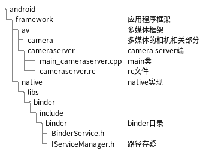

# Camera 服务端

## CameraService

### 涉及的类文件路径



## 初始化流程

### 初始化并注册进大管家

init 程序解析 `cameraserver.rc` 调用 `main_mediaserver.cpp` 初始化 camera service 服务

- `main_mediaserver.cpp` 调用 CameraService 的 instantiate() 方法初始化 CameraService
- CameraService 继承自 BinderService，instantiate() 方法为 BinderService 方法
- 在 instantiate() 方法中调用 publish()
- 在 publish() 方法中实例化 CameraService，并注册到大管家 ServiceManager
  - BinderService 通过调用 SERVICE::getServiceName() 获取字符服务名称
    - BinderService 是一个模板类，由 CameraService 的定义可以看到：泛型 SERVICE 是 CameraService
    - 所以最终调用 CameraService 的 getServiceName() 方法
    - CameraService 的 getServiceName() 方法返回 "media.camera"，这个名称和 app 端获取的 service 名称一致
  - 之后通过调用 sm->addService 方法，将 CameraService 注册进大管家 ServiceManager 中

### 关键代码

```c++
// main_mediaserver.cpp
int main(int argc __unused, char** argv __unused)
{
    // ...
    // 初始化 CameraService
    CameraService::instantiate();
    // ...
}

// CameraService.h
class CameraService :
    public BinderService<CameraService>,  // 继承 BinderService，泛型为 CameraService
    public virtual ::android::hardware::BnCameraService,
    public virtual IBinder::DeathRecipient,
    public virtual CameraProviderManager::StatusListener
{
    // Implementation of BinderService<T>
    // 与客户端 getSystemService(CAMERA_SERVICE) 名称一致
    static char const* getServiceName() { return "media.camera"; }
}

// BinderService.h
template<typename SERVICE>
class BinderService
{
public:
    static status_t publish(bool allowIsolated = false,
                            int dumpFlags = IServiceManager::DUMP_FLAG_PRIORITY_DEFAULT) {
        sp<IServiceManager> sm(defaultServiceManager());
        // 将 CameraService 注册进大管家 ServiceManager 中
        return sm->addService(String16(SERVICE::getServiceName()), new SERVICE(), allowIsolated, dumpFlags);
    }
    
    // 调用 publish()
    static void instantiate() { publish(); }
}
```

## 初始化服务
- 在实例化 CameraService 之后，HAL 会回调 onFirstRef()
- 在 enumerateProviders() 方法中，会实例化 CameraProviderManager 并调用 initialize(this) 方法初始化
- CameraProviderManager 的 initialize() 方法中，调用 HardwareServiceInteractionProxy 的 registerForNotifications() 与 CameraProvider通信
- 

```c++
// CameraService.cpp
void CameraService::onFirstRef()
{
    // 枚举 Provider
    res = enumerateProviders();
}

// CameraProviderManager.h

// 第二个参数为默认参数
status_t initialize(wp<StatusListener> listener,
            ServiceInteractionProxy *proxy = &sHardwareServiceInteractionProxy);

struct HardwareServiceInteractionProxy : public ServiceInteractionProxy {
      virtual bool registerForNotifications(
              const std::string &serviceName,
              const sp<hidl::manager::V1_0::IServiceNotification>
              &notification) override {
          // 调用 ICameraProvider 
          return hardware::camera::provider::V2_4::ICameraProvider::registerForNotifications(
                  serviceName, notification);
      }
      virtual sp<hardware::camera::provider::V2_4::ICameraProvider> tryGetService(
              const std::string &serviceName) override {
          return hardware::camera::provider::V2_4::ICameraProvider::tryGetService(serviceName);
      }
      virtual sp<hardware::camera::provider::V2_4::ICameraProvider> getService(
              const std::string &serviceName) override {
          return hardware::camera::provider::V2_4::ICameraProvider::getService(serviceName);
      }
      virtual hardware::hidl_vec<hardware::hidl_string> listServices() override;
  };            
  
// CameraProviderManager.cpp
status_t CameraProviderManager::initialize(wp<CameraProviderManager::StatusListener> listener,
        ServiceInteractionProxy* proxy) {
    std::lock_guard<std::mutex> lock(mInterfaceMutex);
   
    mListener = listener;
    mServiceProxy = proxy; // 默认参数
    mDeviceState = static_cast<hardware::hidl_bitfield<provider::V2_5::DeviceState>>(
        provider::V2_5::DeviceState::NORMAL);

    // 注册将触发所有已知提供商的通知
    bool success = mServiceProxy->registerForNotifications(
        /* instance name, empty means no filter */ "",
        this);

    for (const auto& instance : mServiceProxy->listServices()) {
        this->addProviderLocked(instance);
    }
    IPCThreadState::self()->flushCommands();
    return OK;
}

status_t CameraProviderManager::addProviderLocked(const std::string& newProvider,
        bool preexisting) {
    auto providerInstance = newProvider + "-" + std::to_string(mProviderInstanceId);
    sp<ProviderInfo> providerInfo = new ProviderInfo(newProvider, providerInstance, this);
    if (!providerPresent) {
        status_t res = tryToInitializeProviderLocked(newProvider, providerInfo);
        if (res != OK) {
            return res;
        }
    }
    mProviders.push_back(providerInfo);
    mProviderInstanceId++;
    return OK;
}

status_t CameraProviderManager::tryToInitializeProviderLocked(
        const std::string& providerName, const sp<ProviderInfo>& providerInfo) {
    sp<provider::V2_4::ICameraProvider> interface;
    interface = mServiceProxy->tryGetService(providerName);
    
    // 调用 initialize
    return providerInfo->initialize(interface, mDeviceState);
}
```